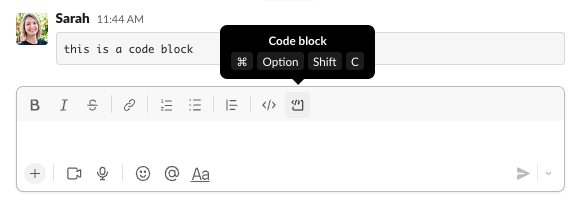
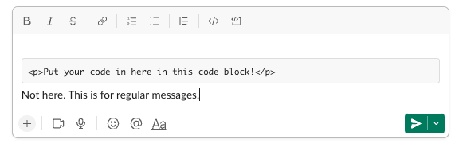

# Jumpstart Student Notes

### Table of Contents

- [Pair programming](#pair-programming)
- [Sharing code in Slack](#sharing-code-in-slack)
- [Coding environment setup](./process/environment.md)
- [HTML](./code/html.md)
- [JavaScript](./code/javascript.md)
- [CSS](./code/css.md)
- [Deployment process](./process/deployment.md)

---

### Treasure Hunt User Stories

During Jumpstart, each group is tasked with creating a treasure hunt web game. When developers are planning a project it is a common practice to break down the task into a series of acceptance criteria. These are the statements that need to be true in order for our task to be complete.

- I can see a webpage with a treasure hunt game.
- I can see a header with the name of my game.
- I can see a list of rules describing how to play the treasure hunt game.
- I can see a three by three gird board game with a question mark on each square.
- When I click on a square, the question mark will turn into an icon.
- If I click the winning square a treasure icon will appear.
- If I click the losing square a bomb icon will appear.
- If I click any other square a neutral icon will appear.
- If I click on the square with the treasure, I will see a notification that I won the game.
- If I click on the square with the bomb, I will see a notification that I lost the game.
- I can continue clicking squares until I hit the treasure or the bomb.
- Once I win or lose I can no longer play the game.
- I can click a button to play a new game.

#### Stretch Challenges

Stretch challenges are additional acceptance criteria that can be implemented after the base challenge has been completed.

- I can see a counter that tells me the number of turns I have left.
- If I run out of turns I will see a notification that I lost.

---

### Pair Programming

There are two roles in pair programming. The `driver` will share their screen and have hands on the keyboard. The `navigator` is managing resources and thinking out loud to support the driver.

---

### Sharing Code in Slack

There is a “code block” selection available within the chat box options in Slack. Use the “code block” selection to send code snippets. The Slack chat font will often add invisible characters or modify punctuation causing errors in your code.

