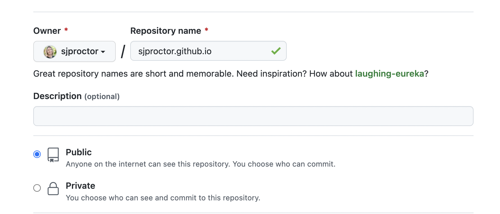
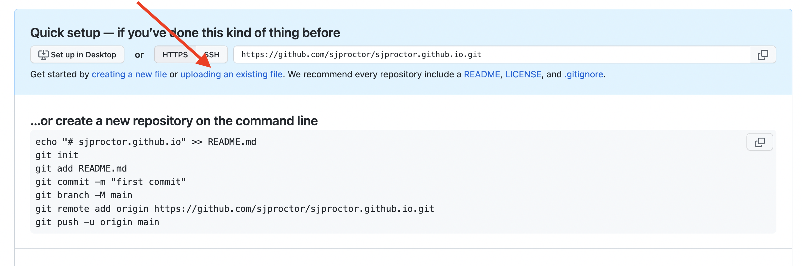

# ⚡️ Deployment

#### Overview

Deployment is the process of making your project available to the internet. The project will only be accessible with the exact url. We will use software created by GitHub to deploy the project. GitHub is a very popular platform developers use to share and collaborate on code. Deployment is a finicky process so it will be important to go slow and be very aware of every detail.

#### Vocabulary

- GitHub
- repository
- deploying

#### Additional Resources

- [GitHub](https://github.com)
- [GitHub Pages](https://pages.github.com/)

#### Process

- Create a GitHub account
- Make sure you know your GitHub handle (username)
- Upload your files following the steps below

#### Troubleshooting Tips

- Did you check your naming conventions very carefully at every step?
- Is your html file named exactly `index.html`?
- Is your GitHub repository named exactly after your username?

---

### Deployment with GitHub

**GitHub** is a web application that allows developers to share and collaborate on code. GitHub holds collections of repositories. A **repository** is a named folder that holds a code project. We can store the treasure hunt project in a repository.

GitHub Pages is a feature on GitHub that allows you to deploy one repository. **Deploying** a project means that the code is available on the internet. This project can only be found as long as the user has the exact url.

### Create a Repository

Following the steps below exercising extreme attention to detail.

1. Create a new repository using this exact naming convention: `{your-username}.github.io`
2. Select the `public` repository option. The project will not successfully deploy if the repository is not public.

3. Ignore all other options and click the `create repository` button.

### Uploading Files

Ensure that your html file for your treasure hunt is named exactly `index.html`

4. Click the `upload an existing file` link.

5. Upload your `index.html` file, your JavaScript file, and CSS file. The order you use to upload does not matter. You should be able to see the name of your files appear when the upload is complete.

### Commit Your Changes

6. Add a commit message. A `commit` is a snapshot of your changes. A commit message communicates information about the changes to your project. Traditionally the first commit to a new repository has the message "initial commit".
7. Click the `commit changes` button.
8. Visit your GitHub Page url: `https://{your-username}.github.io`

Enjoy and share the url with friends and family!

---

[Back to the main page](../README.md)
